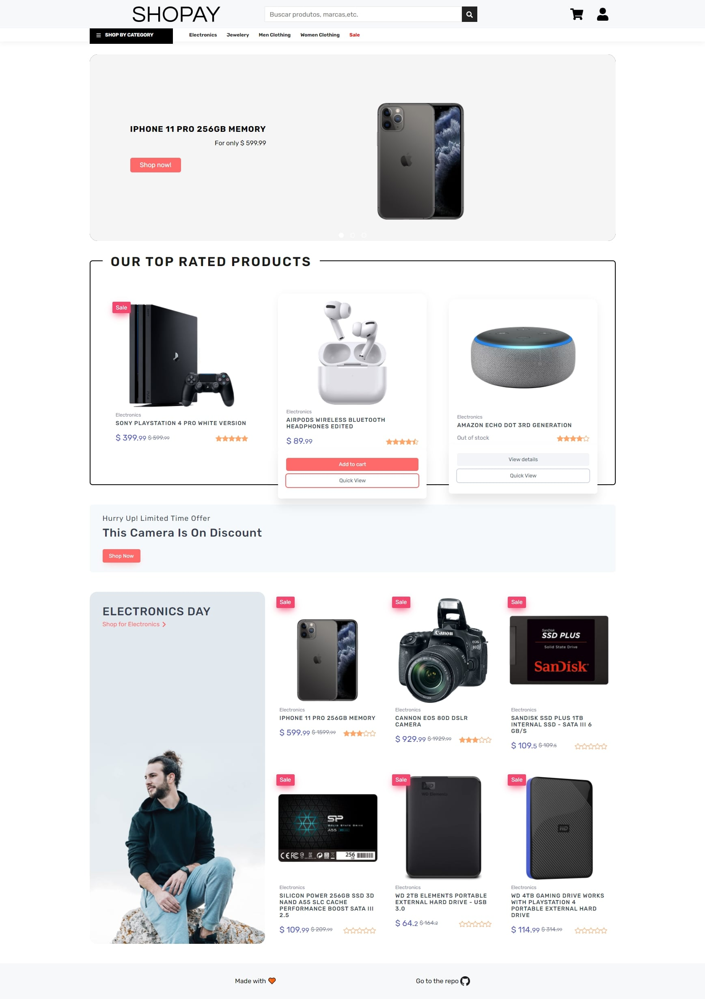
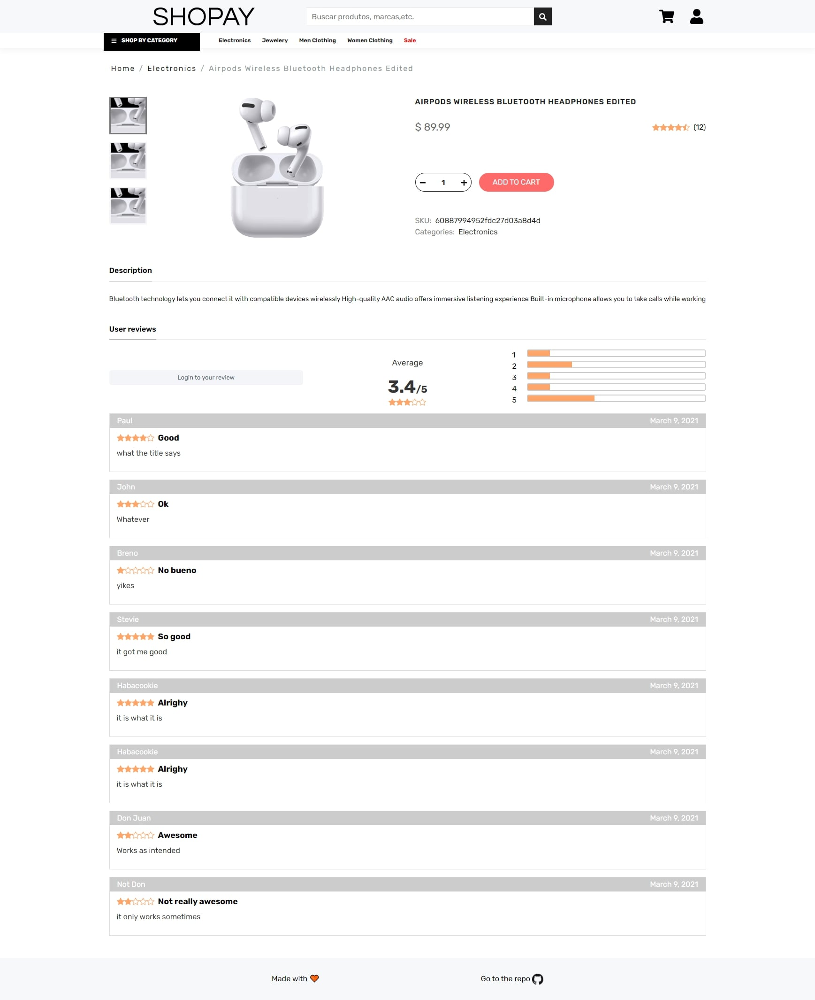
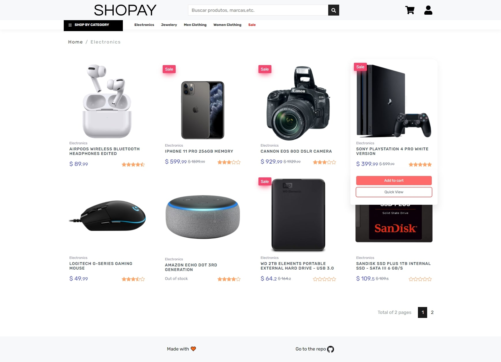
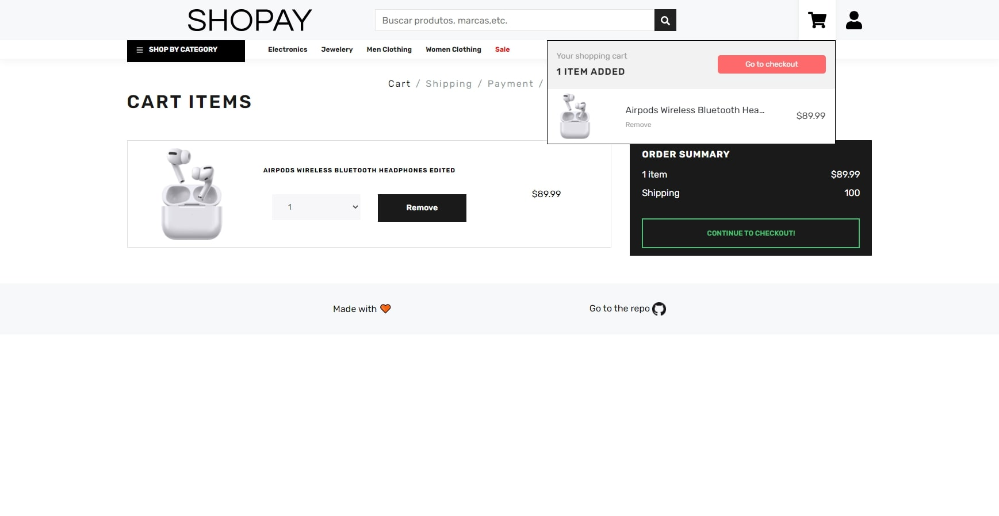
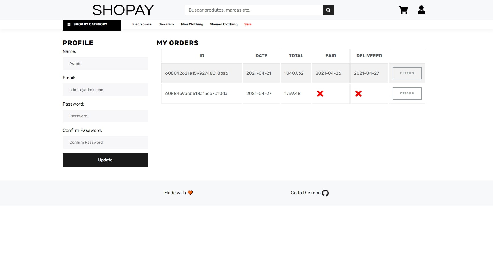

# Screenshots

<details><summary>Home</summary>
<p>

</p>
</details>
<details><summary>Product</summary>
<p>

</p>
</details>
<details><summary>Category</summary>
<p>

</p>
</details>
<details><summary>Cart</summary>
<p>

</p>
</details>
<details><summary>Profile/Orders</summary>
<p>

</p>
</details>

# Functionality

- [x] Product fetching/sorting
- [x] Fully functional shopping cart
- [x] Product reviews and ratings
- [x] Product pagination
- [x] Product search feature
- [x] User profile with orders
- [x] Mark orders as delivered option
- [x] Checkout process (shipping, payment method, etc)
- [x] PayPal and Mercado Pago integration
- [x] Responsive design


# Technologies

## Front-end

- [Create React App](https://create-react-app.dev/)
- [Axios](https://github.com/axios/axios)
- [Styled Components](https://styled-components.com/)
- [Storybook](https://storybook.js.org/)
- [React icons](https://react-icons.github.io/react-icons/)
- [React Paypal button (v2)](https://www.npmjs.com/package/react-paypal-button-v2)
- [Redux](https://react-redux.js.org/)
  - [Thunk](https://github.com/reduxjs/redux-thunk)

### Folder Structure

```
┌───actions
│   └─ Collection of Redux action
├───reducers
│   └─ Collection of Redux reducers
├───types
│   └─ Constants used in Redux
├───components
│   ├───atoms
│   │   └─ The smallest part of a component
│   ├───molecules
│   │   └─ Small combinantions of atoms
│   └───organisms
│       └─ Larger combinations of atoms and molecules
├───pages
│   └─ Combination of organisms and deals with getting the data
└───styles
    └─ Global/Commonly used styles
```

## Run
$ npm start


```
